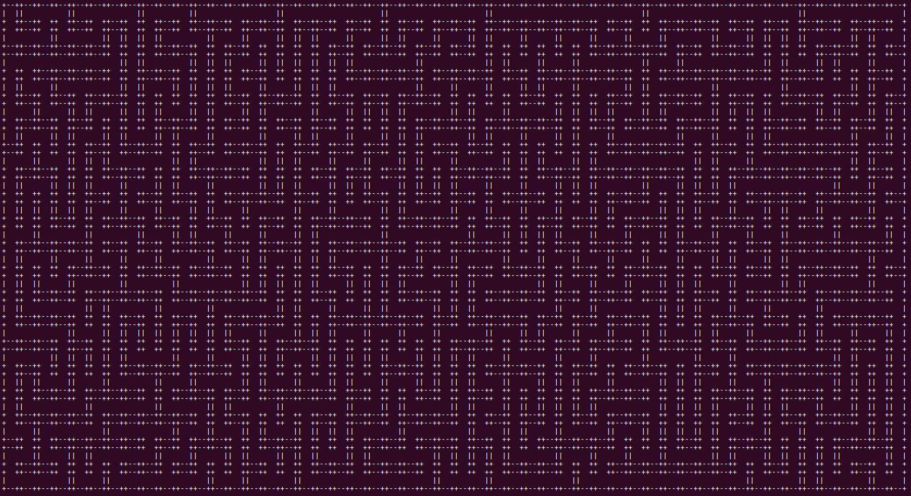

# gomaze
Building a maze to learn Go.

Used [Termloop](https://github.com/JoelOtter/termloop), a terminal-based game engine, to render the maze.
You should check it out! They have nice tutorials.

# Instructions

1. Run `go get github.com/wluu/gomaze`.
2. Inside the `github.com/wluu/gomaze` directory, run `go run maze.go --width <NUM> --height <NUM>`.
3. Move around the maze with the arrow keys.

